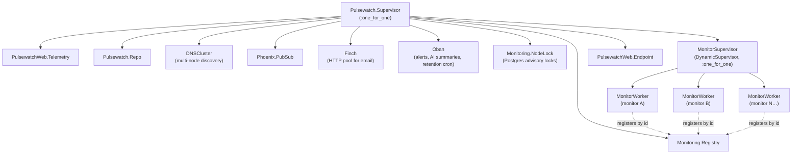

# Pulsewatch

A website uptime monitor: it checks a set of URLs on a schedule, alerts
the moment one goes down, and writes a plain-English summary once it
recovers. Built for engineering hiring managers evaluating backend and
systems-design skills, not just CRUD.

[](https://github.com/Nabeel-Siddiqui/pulsewatch/actions)

**Runs locally in under 5 minutes** with seeded demo data. See
[Running it locally](#running-it-locally).


## What it does

- Add a URL, pick a check interval (30s–1h) and expected status code,
  and Pulsewatch starts polling it immediately.
- A monitor is marked **down** after 2 consecutive failed checks, not
  the first (that avoids paging on a single blip), which opens an
  **incident**.
- The moment an incident opens or resolves, its owner gets emailed and,
  if configured, a webhook fires, with retries and backoff if the
  receiving endpoint is briefly unavailable.
- On resolve, an LLM turns the incident's raw check history into a
  short, readable summary ("down for 12 minutes, timing out on every
  request, recovered without intervention"). It's generated in the
  background and never something the app waits on or fails over if the
  AI provider is slow or unconfigured (see [ADR 5](docs/decisions/0005-ai-summaries-optional-non-blocking.md)).
- A live-updating dashboard (current status, last response time, 24h
  uptime %) and a per-monitor detail page with a response-time chart
  and full incident history.
- A versioned, rate-limited JSON API (`/api/v1`) with per-user tokens
  and OpenAPI docs at `/api/swaggerui`, for anyone who'd rather script
  against it than click through the UI.

## Why Elixir for this, specifically

An uptime monitor is close to the shape of problem Erlang was built
for: many independent, long-lived, mostly-idle things that occasionally
need to do work and occasionally fail, where one failing must never
take down the rest. This app leans on that directly.

- **A process per monitor, supervised, that's allowed to crash.** Every
  monitor gets its own `GenServer`, checking on its own schedule. If
  checking one URL crashes, OTP restarts *only that process* — every
  other monitor keeps checking on schedule, unaffected. `MonitorWorker`
  doesn't defensively catch every possible failure; it trusts the
  supervisor, and puts the actual defensive logic (what counts as
  "down," when to open an incident) in a plain, pure module (`Checker`)
  that's fully unit-tested without any process in the loop.
  [ADR 1](docs/decisions/0001-one-process-per-monitor.md)
- **The database, not the language, is the source of truth for
  correctness.** OTP gives fast, isolated processes, but not
  cross-process atomicity for free. Where two things must happen
  together (recording an incident and queuing its alert job) or must
  never both be true (two open incidents for one monitor), this app
  leans on Postgres — `Ecto.Multi` and a partial unique index,
  respectively — rather than coordinating it purely in-process.
  [ADR 2](docs/decisions/0002-oban-vs-tasks.md) ·
  [ADR 3](docs/decisions/0003-db-constraint-open-incidents.md)
- **Clustering is a library, not a rewrite.** Scaling to multiple nodes
  is `dns_cluster` plus one small addition (`NodeLock`, built on
  Postgres advisory locks) to stop every node from redundantly running
  every monitor. It didn't require a different architecture.
  [ADR 4](docs/decisions/0004-multi-node-duplicate-prevention.md)

## Architecture

Pulsewatch runs as one OTP supervision tree, with a dedicated process
per monitored URL:



A crash in any single `MonitorWorker` is contained by `MonitorSupervisor`
and restarts in isolation — every sibling worker, and everything else in
the tree, is unaffected. See
[ADR 1](docs/decisions/0001-one-process-per-monitor.md) for why this
shape was chosen over a single central scheduler.

## Tech stack

Phoenix 1.7 + LiveView · Ecto/Postgres · Oban (background jobs, cron) ·
Req (HTTP, behind a behaviour + Mox everywhere it's used) · Swoosh
(email) · Anthropic API for AI summaries (with a canned-response demo
mode when no key is configured) · Hammer (rate limiting) ·
open_api_spex (OpenAPI/Swagger) · Credo (`--strict`) + Dialyzer +
ExCoveralls in CI · GitHub Actions · Docker (`mix release`).

## Running it locally

Prerequisites: Elixir 1.20.3 / OTP 29.0.5 (see [`Dockerfile`](Dockerfile)
— any recent Elixir/OTP pair should work fine too) and a local Postgres.

```bash
git clone <this-repo-url>
cd pulsewatch
mix setup        # deps, DB create + migrate, seeds (demo user + sample monitors), assets
mix phx.server
```

Visit `http://localhost:4000` and log in with `demo@pulsewatch.dev` /
`demo-password-please-change`. Three sample monitors are already there
and being checked. No API keys are required: AI summaries run in demo
mode automatically until `ANTHROPIC_API_KEY` is set (see
[ADR 5](docs/decisions/0005-ai-summaries-optional-non-blocking.md)).

To verify the whole thing end to end:

```bash
mix test                # 258 tests, no real network/LLM calls anywhere
mix credo --strict
mix dialyzer
```

## Design decisions

Six of the less-obvious calls made building this are written up in
[`docs/decisions/`](docs/decisions/), each with the alternative
considered and why it lost:

1. [One OTP process per monitor](docs/decisions/0001-one-process-per-monitor.md)
2. [Oban for alerts/summaries, not plain Tasks](docs/decisions/0002-oban-vs-tasks.md)
3. [A database constraint for "one open incident per monitor"](docs/decisions/0003-db-constraint-open-incidents.md)
4. [Postgres advisory locks over Horde for multi-node](docs/decisions/0004-multi-node-duplicate-prevention.md)
5. [AI summaries are optional and non-blocking](docs/decisions/0005-ai-summaries-optional-non-blocking.md)
6. [30-day check retention](docs/decisions/0006-data-retention.md)

`CLAUDE.md` in the repo root has the conventions every phase of this
build held to (contexts own all business logic, the web layer never
touches `Repo` directly, every public context function has `@doc` +
`@spec`, no silently swallowed errors, tests ship alongside every
feature, no test ever calls a real LLM).

## What I'd do next

- **Rebalancing for multi-node.** The current advisory-lock scheme
  ([ADR 4](docs/decisions/0004-multi-node-duplicate-prevention.md)) is
  static: a monitor stays on whichever node first claimed it, even if
  that node becomes overloaded. Worth revisiting (Horde, or a simple
  periodic rebalancing pass) if this ever needed to run at a scale where
  load distribution actually mattered.
- **Aggregated retention.** Right now old checks are just deleted after
  30 days ([ADR 6](docs/decisions/0006-data-retention.md)). Rolling them
  up into daily/weekly uptime aggregates before deletion would let the
  dashboard show a real long-term reliability trend instead of losing
  that history entirely.
- **Status pages.** A public, shareable page per monitor (or per user)
  showing current status and recent incident history. The natural next
  feature once alerting and history already exist.
- **More check types.** Currently HTTP GET + status code only. TCP port
  checks and response-body assertions (not just status code) are the
  obvious next checks to add, and the `HttpClient` behaviour already
  used for the HTTP case is the right seam to add new checker types
  behind.
- **Per-monitor alert routing.** Right now every alert goes to the
  monitor's owner by email, plus an optional webhook. Slack/PagerDuty
  integrations and per-monitor (not just per-account) notification
  preferences are a natural extension of the existing `Alerts` context.
